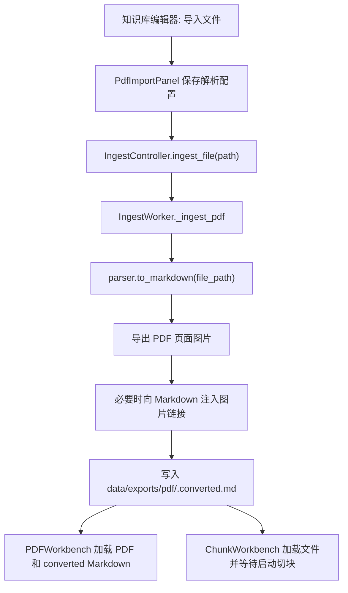
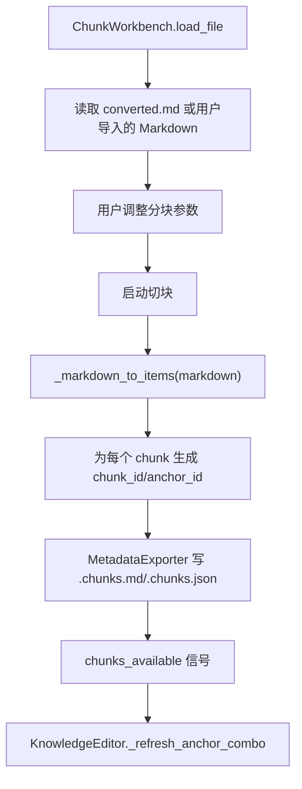
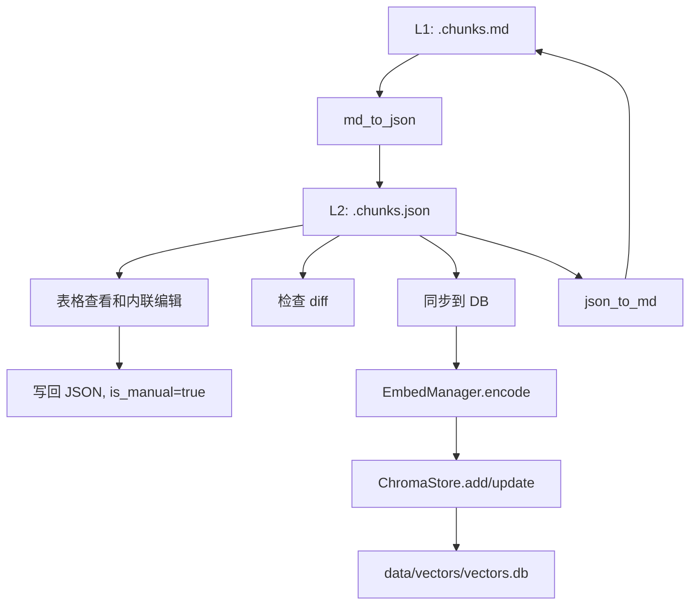
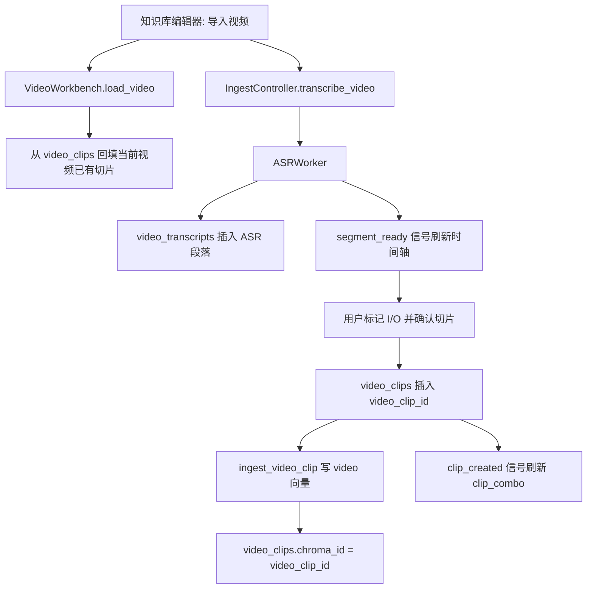
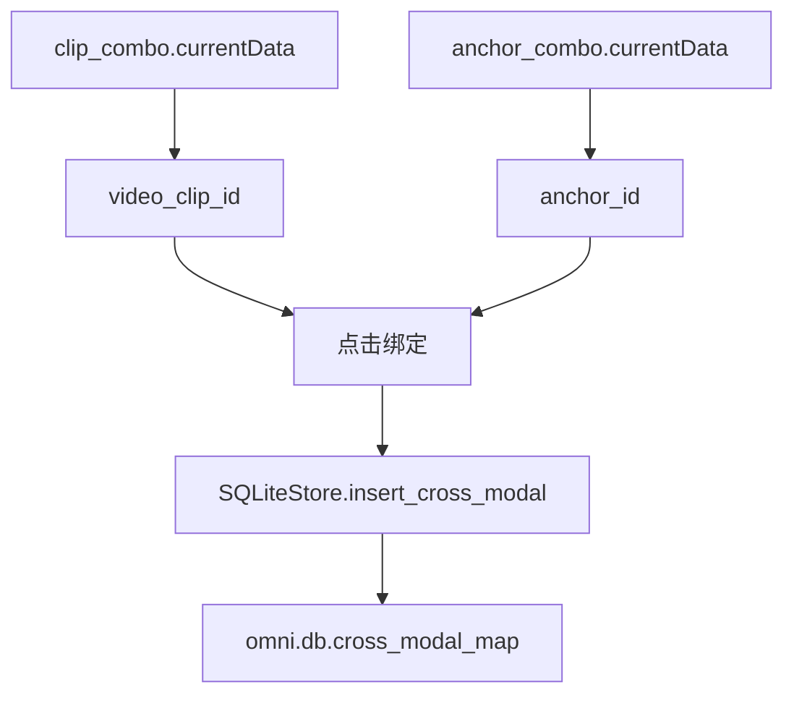

# OmniLocalRAG 数据流向报告

生成日期: 2026-04-10

## 1. 范围

本报告梳理以下链路:

| 链路 | 入口 | 主要输出 |
| --- | --- | --- |
| 文件导入 | 知识库编辑器顶部“导入文件” | `.converted.md`、页面图片、后续 `.chunks.md/.chunks.json` |
| Markdown 分块 | 分块管理页“导入Markdown/启动切块” | `.chunks.md/.chunks.json`、`anchor_combo` 数据 |
| 数据流管理 | 数据流管理页 L1/L2/L3 | JSON 编辑、MD/JSON 转换、同步到 `vectors.db` |
| 视频导入 | 知识库编辑器顶部“导入视频” | `video_transcripts`、用户确认后的 `video_clips`、video 向量 |
| 跨模态绑定 | 顶部跨模态绑定区 | `cross_modal_map(video_clip_id, pdf_anchor_id)` |

## 2. 数据存储总览

| 存储 | 路径 | 管理对象 | 主要写入方 | 主要读取方 |
| --- | --- | --- | --- | --- |
| 转换 Markdown | `data/exports/pdf/*.converted.md` | PDF/文件转换后的原始 Markdown | `IngestWorker._convert_file_to_markdown`、`PDFWorkbench._save_full_markdown` | `PDFWorkbench`、`ChunkWorkbench` |
| PDF 页面图片 | `data/exports/pdf/*_images/page_*.png` | PDF 每页图片 | `IngestWorker._export_pdf_page_images`、`PDFWorkbench._export_page_images` | Markdown 编辑器、外部预览 |
| Chunk Markdown | `data/exports/{pdf,markdown}/*.chunks.md` | 人可读分块数据 | `MetadataExporter.export_chunks`、`json_to_md` | `DataflowPanel` |
| Chunk JSON | `data/exports/{pdf,markdown}/*.chunks.json` | 程序可读分块数据 | `MetadataExporter.export_chunks`、`md_to_json`、API 优化 | `DataflowPanel`、`json_db_sync`、`anchor_combo` |
| 向量库 | `data/vectors/vectors.db` | 文档 chunk 向量、视频 clip 向量 | `ChromaStore.add/update/delete` | 检索、数据流管理 |
| 业务 SQLite | `data/omni.db` | 视频转写、视频切片、跨模态绑定 | `SQLiteStore` | 视频工作台、绑定区 |

## 3. ID 语义

| ID | 来源 | 当前生成方式 | 当前用途 | 稳定性 |
| --- | --- | --- | --- | --- |
| `chunk_id` | 文档/Markdown 分块 | `stable_chunk_id(source_file, source_type, page, heading_path, content)` | `.chunks.json` 主键、向量行 `id` | 同一输入重复切块稳定 |
| `anchor_id` | 文档/Markdown 分块 | 当前等于稳定 `chunk_id` | 跨模态绑定的文档端 ID、向量行 `anchor_id` | 同一输入重复切块稳定 |
| `video_transcripts.id` | ASR 转写段落 | `uuid.uuid4()` | 单条 ASR 片段记录 | 不用于跨模态绑定 |
| `video_clip_id` | 用户确认视频切片 | `SQLiteStore.insert_clip()` 生成 UUID | `video_clips.id`、video 向量 `id/anchor_id`、跨模态绑定视频端 ID | 保存后稳定 |
| `cross_modal_map.id` | 用户点击绑定 | `uuid.uuid4()` | 绑定记录主键 | 保存后稳定 |

结论:

| 检查点 | 当前状态 |
| --- | --- |
| `video_clip_id` 是否清楚 | 新建或加载当前视频后，下拉框显示视频文件名、时间段、摘要、ID 前缀；实际绑定值仍是完整 `video_clip_id` |
| `anchor_id` 是否清楚 | 下拉框显示来源文件名、`anchor_id`、页码、标题、内容预览；实际绑定值仍是完整 `anchor_id` |
| 多文件区分 | 显示层已补来源文件名；数据层没有独立文档注册表 |
| ID 稳定性 | `video_clip_id` 稳定；`anchor_id/chunk_id` 已从随机 UUID 改为确定性 ID，但大幅调整内容或分块参数仍可能改变 |

## 4. 文件导入数据流



关键代码:

| 步骤 | 文件 |
| --- | --- |
| 顶部导入文件 | `app/views/knowledge_editor.py::_import_pdf` |
| 文件转换 Markdown | `app/workers/ingest_worker.py::_convert_file_to_markdown` |
| PDF 纠错编辑器加载 | `app/views/pdf_workbench.py::load_file/load_converted_markdown` |
| 转换完成后进入分块管理 | `app/views/knowledge_editor.py::_on_ingest_done` |

当前正确逻辑:

| 逻辑点 | 结论 |
| --- | --- |
| 文件导入是否直接切块入库 | 不直接切块，不直接入向量库 |
| 文件导入的第一产物 | `.converted.md` 和页面图片 |
| 用户修改 Markdown 后如何生效 | 在 PDF 纠错页保存，再到分块管理启动切块 |
| 图片路径如何进入 Markdown | 转换器没有图片链接时，由 `_inject_page_images_if_needed` 注入 `` |

## 5. 分块和 anchor 数据流



关键代码:

| 步骤 | 文件 |
| --- | --- |
| 分块参数和启动 | `app/views/chunk_workbench.py` |
| Markdown 结构化切块 | `app/workers/ingest_worker.py::_markdown_to_items` |
| 导出 `.chunks.md/.chunks.json` | `app/models/metadata_exporter.py` |
| 刷新 `anchor_combo` | `app/views/knowledge_editor.py::_refresh_anchor_combo` |

`anchor_combo` 当前显示:

```text
source_file | anchor_id | p页码 | heading_path | 内容预览
```

`anchor_combo.currentData()` 当前保存:

```text
anchor_id
```

## 6. 数据流管理页 L1/L2/L3



数据流管理页只管理文档 chunk 到向量库的流向:

| 功能 | 目标 |
| --- | --- |
| 列出 `.chunks.md` | `data/exports/**/*.chunks.md` |
| 选择 MD 自动加载 JSON | 同名 `.chunks.json` |
| MD 转 JSON | `md_json_converter.md_to_json` |
| JSON 转 MD | `md_json_converter.json_to_md` |
| 检查变更 | `json_db_sync.get_sync_status` |
| 同步到 DB | `json_db_sync.sync_json_to_db` |
| DB 统计 | 仅统计 `data/vectors/vectors.db` 的 `vectors` 表 |

注意:

| 边界 | 当前状态 |
| --- | --- |
| 是否管理 `omni.db` | 否 |
| 是否管理视频 transcript | 否 |
| 是否管理 video clip | 否 |
| 是否管理跨模态绑定 | 否 |

## 7. 向量库写入规则

`vectors.db` 表结构:

| 字段 | 文档 chunk | 视频 clip |
| --- | --- | --- |
| `id` | `chunk_id` | `video_clip_id` |
| `content` | chunk 文本 | 文件名、时间段、摘要拼接文本 |
| `source_type` | `pdf` 或 `markdown` | `video` |
| `anchor_id` | `chunk_id/anchor_id` | `video_clip_id` |
| `pdf_payload` | `{file, page, coords}` | `{}` |
| `video_payload` | `{}` | `{file, start, end}` |
| `is_manual` | JSON 手动编辑或导入状态 | true |

写入路径:

| 来源 | 写入函数 |
| --- | --- |
| 文档 JSON 同步 | `json_db_sync.sync_json_to_db` |
| 视频 clip 确认 | `IngestController.ingest_video_clip` |
| 单 chunk 重嵌入 | `IngestController.re_embed_chunk` |

## 8. 视频导入数据流



关键代码:

| 步骤 | 文件 |
| --- | --- |
| 导入视频按钮 | `app/views/knowledge_editor.py::_import_video` |
| ASR 调度 | `app/controllers/ingest_controller.py::transcribe_video` |
| ASR 写入 transcript | `app/workers/asr_worker.py::run` |
| 用户确认切片 | `app/views/video_workbench.py::_confirm_clip` |
| 视频 clip 向量化 | `app/controllers/ingest_controller.py::ingest_video_clip` |
| 当前视频已有 clip 回填 | `app/views/video_workbench.py::_load_existing_clips` |
| 刷新 `clip_combo` | `app/views/knowledge_editor.py::_refresh_clip_combo` |

`clip_combo` 当前显示:

```text
video_file | start-end | semantic_summary | video_clip_id前缀
```

`clip_combo.currentData()` 当前保存:

```text
video_clip_id
```

## 9. 跨模态绑定数据流



`cross_modal_map` 当前字段:

| 字段 | 含义 |
| --- | --- |
| `id` | 绑定记录 UUID |
| `video_clip_id` | 指向 `video_clips.id` |
| `pdf_anchor_id` | 文档 chunk 的 `anchor_id` |
| `note` | 备注，目前 UI 未使用 |
| `created_at` | 创建时间 |

当前约束:

| 约束 | 当前状态 |
| --- | --- |
| `video_clip_id` 外键 | DDL 声明引用 `video_clips(id)` |
| `pdf_anchor_id` 外键 | 没有外键，仅文本保存 |
| 绑定记录查看 UI | 暂无 |
| 绑定记录删除/修改 UI | 暂无 |
| 按文件筛选绑定 | 暂无 |

## 10. 当前数据库快照

采样时间: 2026-04-10 本地工作区

| 数据库 | 表 | 数量 |
| --- | --- | ---: |
| `data/omni.db` | `video_transcripts` | 450 |
| `data/omni.db` | `video_clips` | 0 |
| `data/omni.db` | `cross_modal_map` | 0 |
| `data/omni.db` | `app_config` | 0 |
| `data/vectors/vectors.db` | `vectors` | 885 |

向量类型分布:

| `source_type` | 数量 |
| --- | ---: |
| `markdown` | 875 |
| `pdf` | 10 |
| `video` | 0 |

视频 transcript 分布:

| `video_file` | transcript 数量 | 时间范围 |
| --- | ---: | --- |
| `系统配置.mp4` | 450 | 0.56s 到 263.73s |

结论:

| 事实 | 解释 |
| --- | --- |
| 有 ASR transcript | 视频已被转写过 |
| 没有 video clip | 用户还没有确认可绑定的视频片段，或 clip 表被清空 |
| 没有 cross modal map | 还没有完成任何跨模态绑定 |
| 没有 video 向量 | 因为没有确认 clip，所以没有 video 类型向量 |

## 11. 逻辑正确性检查

| 编号 | 检查项 | 当前结论 | 风险 |
| --- | --- | --- | --- |
| 1 | 文件导入后是否应立即入库 | 当前设计不是立即入库，而是先转 Markdown，再由分块管理生成 chunk | 低 |
| 2 | 分块完成后 anchor 是否进入下拉框 | 已进入，下拉项含 source_file、anchor_id、页码、标题、内容预览 | 低 |
| 3 | JSON 加载后 anchor 是否进入下拉框 | 已进入，下拉项含 source_file | 低 |
| 4 | 视频导入后 clip 是否进入下拉框 | 当前视频已有 clip 会回填，新建 clip 会加入 | 低 |
| 5 | `video_clip_id` 是否写入 DB | 用户确认切片时写入 `video_clips.id` | 低 |
| 6 | `video_clip_id` 是否写入向量库 | `ingest_video_clip` 使用 `doc_id=clip_id` 写入 `vectors.id` | 低 |
| 7 | 跨模态绑定是否保存 | 点击绑定写入 `cross_modal_map` | 低 |
| 8 | 数据流管理是否同步文档 JSON 到向量库 | 通过 `sync_json_to_db` 完成 | 低 |
| 9 | 数据流管理是否覆盖视频/绑定数据 | 不覆盖，也不管理 | 中 |
| 10 | `anchor_id` 是否长期稳定 | 已改为确定性 ID；同一文件同一 chunk 内容重复生成稳定 | 中 |
| 11 | `pdf_anchor_id` 是否有数据库外键校验 | 无外键，可能绑定到已不存在的 chunk | 中 |
| 12 | 视频文件名是否唯一 | 当前只存 basename，重名视频可能混淆 | 中 |
| 13 | ASR transcript 是否去重 | 当前重复导入同名视频会继续插入 transcript | 中 |

## 12. 目前推荐的正确控制模型

建议将系统明确拆成四层:

| 层 | 名称 | 管理对象 | 当前状态 |
| --- | --- | --- | --- |
| L0 | 原始资源层 | PDF、Markdown、视频文件、页面图片 | 已存在 |
| L1 | 人工校正层 | `.converted.md`、`.chunks.md`、视频切片摘要 | 已存在 |
| L2 | 结构化交换层 | `.chunks.json`、ASR segments、clip records | 部分存在 |
| L3 | 检索和绑定层 | `vectors.db`、`omni.db.cross_modal_map` | 部分存在 |

推荐 UI 分工:

| 面板 | 职责 |
| --- | --- |
| PDF 纠错 | 只负责文件到 Markdown 的纠错 |
| 分块管理 | 只负责 Markdown 到 chunks 的生成和参数控制 |
| 数据流管理 | 只负责 `.chunks.md/.chunks.json` 到 `vectors.db` 的管理 |
| 视频切片 | 只负责 ASR 展示、人工确认 clip、clip 向量化 |
| 跨模态绑定管理 | 已新增，负责 chunk 与 clip 的可视化绑定、查询、删除、修复 |

## 13. 必要改进建议

| 优先级 | 建议 | 原因 |
| --- | --- | --- |
| P0 | 新增跨模态绑定管理面板 | 已实现基础版，支持查看、筛选、绑定、删除、修复 |
| P0 | 增加 `SQLiteStore.list_clips/list_cross_modal_maps/delete_cross_modal` | 已实现 `list_clips/list_cross_modal/update_cross_modal_anchor/delete_cross_modal` |
| P1 | `cross_modal_map` 增加 `source_file` 或通过 anchor 查询来源 | 多文档场景需要按文件筛选 |
| P1 | `video_clips` 增加 `video_path` 或 `video_hash` | basename 重名会混淆 clip |
| P1 | 为 chunk ID 引入稳定策略 | 已实现确定性 ID；后续可升级为文档注册表 + 锚点版本管理 |
| P1 | 数据流管理右侧增加 `omni.db` 统计 | 当前只显示向量库，不显示视频和绑定状态 |
| P2 | ASR transcript 增加去重策略 | 重复导入同名视频会重复插入 transcript |
| P2 | 绑定前校验 `pdf_anchor_id` 是否存在于 `vectors.db` 或当前 JSON | 降低无效绑定风险 |

## 14. 已实现的稳定 ID 策略

旧逻辑:

```text
chunk_id = uuid.uuid4()
anchor_id = chunk_id
```

问题:

```text
同一个文档重新切块 -> 新 UUID -> 旧 cross_modal_map.pdf_anchor_id 找不到实际 chunk
```

当前已实现:

```text
anchor_id = <source_type>:<source_stem>-<source_hash>:p<page>:<content_hash>
chunk_id = anchor_id
```

实现位置:

| 文件 | 用途 |
| --- | --- |
| `app/models/stable_ids.py` | 统一生成稳定 chunk/anchor ID |
| `app/views/chunk_workbench.py` | 分块管理生成 `.chunks.json/.chunks.md` 时使用稳定 ID |
| `app/workers/ingest_worker.py` | 旧 Markdown 直接入库路径使用稳定 ID |

仍需注意:

```text
如果用户大幅修改内容、页码、标题路径，或调整分块参数导致 chunk 边界变化，content_hash 仍会改变。
```

更完整的长期方案:

```text
anchor_id = 稳定业务 ID
chunk_id = 版本化向量 ID
```

后者更完整，但改动更大。

## 15. 最终结论

当前主链路是基本正确的:

| 主链路 | 结论 |
| --- | --- |
| 文件导入到 Markdown | 正确 |
| Markdown 到 chunks | 正确 |
| JSON 到向量库 | 正确 |
| 视频转写到 transcript | 正确 |
| 用户确认 clip 到 video_clips 和 video 向量 | 逻辑正确，但当前数据库暂无 clip |
| clip 与 anchor 绑定 | 写入路径正确 |

当前最大不足不是单步调用错误，而是管理面不足:

| 不足 | 影响 |
| --- | --- |
| 没有全局视频 clip 管理面板 | 用户难以查看已有 clip |
| 跨模态绑定列表 | 已新增基础管理面板，可查看、筛选、绑定、删除、修复 |
| 绑定删除/修复 | 已通过 `CrossModalPanel` 和 `SQLiteStore` CRUD 支持 |
| `anchor_id` 稳定性 | 已从随机 UUID 改为确定性 ID；仍建议后续做文档注册表和版本化锚点 |
| 数据流管理不覆盖 `omni.db` | 文档向量和视频/绑定状态被分成两套视图 |

因此下一步应优先补“文档注册表/视频资源表”和“绑定有效性校验”，而不是继续扩展顶部两个下拉框。
